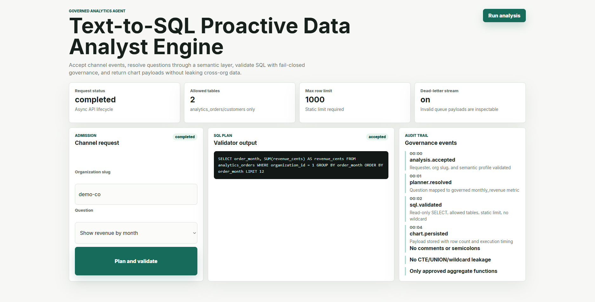
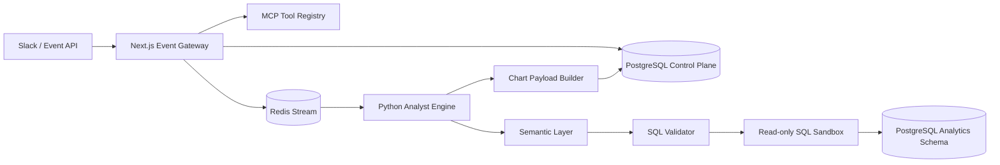

# Text-to-SQL Proactive Data Analyst Engine

[](https://github.com/Daniel5569/text-to-sql-proactive-data-analyst-engine/actions/workflows/ci.yml)




[](https://vercel.com/new/clone?repository-url=https://github.com/Daniel5569/text-to-sql-proactive-data-analyst-engine&root-directory=apps/web)

Production-shaped portfolio case study for AI-native teams building proactive business analysts, Slack data agents, and safe text-to-SQL systems over relational data.

## What "proactive" means

Most text-to-SQL systems are reactive: a user asks a question and the system responds. This engine is designed for **proactive** data analyst workflows — it can be triggered by scheduled jobs, Slack events, or upstream pipeline signals, and it delivers results asynchronously. The analyst does not wait at a prompt; the system works in the background and surfaces answers through existing channels (Slack, dashboard, email).

The control flow is: event admission → `202 Accepted` → Redis Stream dispatch → semantic planning → SQL validation → sandbox execution → chart generation. The user never blocks on a synchronous query.

## SQL Safety — the core differentiator

Most text-to-SQL systems generate and execute arbitrary SQL. This is unsafe in production: generated queries can read sensitive tables, run expensive full scans, or — if the system has write access — mutate data.

This engine enforces safety at the Python layer before any query runs:

| Check | What it blocks |
|-------|---------------|
| **Semantic layer** | Queries that reference tables or columns outside governed definitions |
| **Parser-backed validation** | Malformed SQL and any statement that is not a `SELECT` |
| **Write rejection** | `INSERT`, `UPDATE`, `DELETE`, `DROP`, `CREATE`, `ALTER` — all rejected |
| **Sensitive table blocklist** | Configurable list of tables that must never be queried |
| **Read-only sandbox** | All queries execute inside a `BEGIN; ... ROLLBACK` transaction |
| **Query timeout** | Configurable wall-clock limit; long-running queries are killed |

Queries that fail any check are dead-lettered with a structured error code — never silently dropped.

## Example queries

```
User: "Show me MRR for Q2 by customer tier"
→ Semantic layer maps "MRR" → governed metric definition
→ Python generates: SELECT tier, SUM(mrr) FROM analytics.subscriptions
                    WHERE quarter = 'Q2-2026' GROUP BY tier
→ Validator: SELECT only, governed tables only, no sensitive columns ✓
→ Executes in read-only sandbox → returns chart payload
```

```
User: "Delete all test accounts"
→ Python validator: DELETE statement → blocked immediately
→ Error: WRITE_NOT_ALLOWED — returned as structured dead-letter
```

```
User: "Show me salaries"
→ Semantic layer: 'salaries' not in governed definitions
→ Error: UNMAPPED_METRIC — query never reaches the database
```

The monorepo demonstrates a two-runtime Node.js + Python architecture:

- **Node.js / Next.js** owns event ingestion, MCP-style tool metadata, request persistence, and Redis Stream dispatch.
- **Python / FastAPI** owns semantic resolution, SQL planning, read-only validation, sandbox execution, and chart payload generation.
- **Redis Streams** decouple user-facing event admission from query planning and execution.
- **PostgreSQL** stores semantic definitions, request state, query attempts, audit events, and demo analytics tables.
- **Docker Compose** runs the full stack with only the gateway exposed to the host.

## Why This Exists

Text-to-SQL demos often look impressive until they touch real companies. Business language is ambiguous, schemas are inconsistent, and one unsafe generated query can leak data or mutate production tables. A credible data analyst agent needs a semantic layer, read-only enforcement, self-consistency checks, auditability, and a way to respond asynchronously inside collaboration channels.

This project treats text-to-SQL as infrastructure: a controlled request pipeline with deterministic business definitions between the model and the database.

## Demo


The demo shows a Slack-style event entering the gateway, a `202 Accepted` response, Redis Stream dispatch, Python semantic planning, read-only SQL validation, and a chart-ready payload.

## Architecture



## Runtime Boundaries

```text
apps/web
  Next.js API gateway, event intake, MCP-style tool manifest, Redis stream producer

services/engine
  FastAPI internal service, Redis stream consumer group, semantic resolver, SQL sandbox

packages/shared
  Cross-runtime JSON contracts for analyst requests

infra
  PostgreSQL control-plane schema, semantic seed data, and sample analytics tables
```

The gateway returns `202 Accepted` after persistence and queue dispatch. It never waits on Python query planning or SQL execution.

## Asynchronous Flow

```text
1. Slack or another event source submits POST /api/analysis.
2. Node validates the question, requester, channel, and semantic profile.
3. Node persists an analysis request in PostgreSQL.
4. Node appends one Redis Stream event and returns 202 Accepted.
5. Python consumes the event through XREADGROUP; stale pending messages are reclaimed with XCLAIM.
6. The semantic layer maps business terms to governed tables, columns, and metrics.
7. The planner proposes a bounded SELECT query.
8. The validator parses SQL and rejects writes, unsafe tables, multiple statements, and missing LIMITs.
9. The sandbox executes inside a read-only transaction with a timeout.
10. The engine stores query attempts and chart payloads for channel delivery.
```

## Semantic Layer

The semantic layer is intentionally explicit. It maps business phrases such as `revenue`, `active customers`, and `churn` to governed metrics and allowed tables. This prevents the LLM or planner from inventing private schema meanings at runtime.

The public implementation uses deterministic planning rules so the repository is runnable without API keys. The boundary is designed so an LLM can propose candidate SQL while the semantic layer and validator remain authoritative.

## Performance Characteristics

These are local reference characteristics and test guardrails, not hosted production SLOs.

| Path | Methodology | Reference Result | Guardrail |
| --- | --- | --- | --- |
| Event admission | Vitest verifies request persistence plus Redis `XADD` | bounded by Postgres insert and one Redis append | no synchronous Python call |
| Semantic planning | Pytest maps business terms to governed metrics | deterministic query plans for supported intents | unsupported terms fail closed |
| SQL validation | Pytest parses candidate SQL and rejects unsafe operations | only single-statement `SELECT` queries pass | no DDL, DML, wildcard mutation, or unsafe table |
| Sandbox execution | Python executes with read-only transaction and timeout boundary | query results become chart JSON | no write-capable connection path |
| Worker failure handling | Pytest injects malformed payloads, unsupported terms, and stale pending messages | invalid jobs are dead-lettered, rejected work fails closed, stale work is XCLAIM-recovered | no dropped channel event |

## Design Decisions & Trade-Offs

| Decision | Benefit | Cost |
| --- | --- | --- |
| Redis Streams over direct Slack response work | Keeps channel latency low, isolates long query execution, and supports XCLAIM recovery | Requires stream lag and retry monitoring |
| Explicit semantic layer over prompt-only SQL generation | Auditable business definitions and safer query scope | Requires up-front modeling work |
| SQL parser validation with read-only transaction | Defense in depth against unsafe generated SQL | Adds runtime overhead |
| Python planner/executor | Strong data tooling ecosystem and clean sandbox boundary | Two-runtime deployment complexity |
| Deterministic public planner | No API key required and reproducible tests | Production version would integrate LLM candidate generation |

## Prerequisites

- Node.js `>=20` (`.nvmrc` is included)
- Python `>=3.11`, developed with `3.12` (`.python-version` is included)
- Docker Engine `>=24`
- Docker Compose v2
- GitHub CLI `gh` for publication automation

Dependency note: the web app is temporarily pinned to `next@16.3.0-canary.43` / `eslint-config-next@16.3.0-canary.43`. On 2026-06-12, the latest stable `16.2.9` still triggers the nested PostCSS audit advisory, while this canary keeps `npm audit --audit-level=moderate` clean. Move back to stable as soon as the patched stable dependency path ships.

## Quick Start

```bash
cp .env.example .env
docker compose up --build
```

Gateway:

```text
http://localhost:3000
```

Only the Next.js gateway exposes a host port. PostgreSQL, Redis, and the Python engine are internal services.

Submit an analyst request:

```bash
curl -X POST http://localhost:3000/api/analysis \
  -H "content-type: application/json" \
  -d '{
    "channel": "slack",
    "organizationSlug": "demo-co",
    "requester": "ops-lead",
    "question": "Show revenue by month for the last quarter",
    "semanticProfile": "saas"
  }'
```

Inspect MCP-style tools:

```bash
curl http://localhost:3000/api/mcp/tools
```

## Testing

Whole-repo check:

```bash
npm run check
```

Node gateway:

```bash
cd apps/web
npm ci
npm test
npm run build
npm run audit
```

Python engine:

```bash
cd services/engine
python -m pip install -e ".[dev]"
python -m pytest
python -m ruff check .
python -m black --check .
```

GitHub Actions runs unit tests, a Postgres/Redis integration test, audit, and the Next.js production build.

## Production Safety

Local `.env` files are ignored; commit only `.env.example`. The gateway and engine allow `change-me-in-production` defaults only when `APP_ENV=development` or `ALLOW_INSECURE_DEV_DEFAULTS=1` is set. In production runtime, missing Redis configuration or default database credentials fail closed.

Requests now carry an explicit `organizationSlug`, and the SQL validator rejects comments, semicolons, CTEs, set operations, wildcard projection, risky functions, and non-static or oversized limits before execution.

## What Is Real Vs Demo

- Real: async analysis API, org lookup, semantic intent mapping, parser-backed SQL validation, read-only execution path, chart payload persistence, dead-letter/XCLAIM recovery, and CI tests.
- Demo-shaped: the planner is deterministic and the channel gateway is metadata-only. Production should add signed Slack verification, request auth, row-level policies, result caching, and webhook delivery retries.

## Known Limitations / Roadmap

- The public planner is deterministic to avoid shipping API keys; production would add LLM candidate generation behind the same semantic and SQL validation boundary.
- Slack delivery is represented as event-channel metadata and chart payload persistence; production would add signed Slack request verification and response webhooks.
- The analytics schema is intentionally small but normalized enough to demonstrate safe joins and governed metrics.
- Stream retry, XCLAIM pending recovery, and dead-letter behavior are implemented; production should add queue lag dashboards and alerting.
- Query result caching and row-level permissions are natural next steps before multi-tenant production use.

## Context

Safe data agents require infrastructure judgment: semantic governance, asynchronous channel workflows, read-only query execution, parser-backed validation, audit logs, and CI-tested behavior. The implementation is intentionally inspectable so the control-plane decisions can be reviewed directly.


## Architecture Decisions

**Why a semantic layer instead of sending the raw schema to the model?**
A raw schema leaks table names, column names, and relationships that should never reach the model — salaries, user PII tables, internal pricing. The semantic layer is a curated, company-controlled vocabulary: `MRR` maps to a governed metric definition; `revenue` maps to a specific column in a specific table. The model works in business language; the layer translates to SQL. This also makes the system unit-testable: governed definitions are deterministic, not probabilistic.

**Why Redis Streams instead of a synchronous API call to the Python engine?**
A text-to-SQL query involves semantic resolution, SQL planning, and sandbox execution — potentially hundreds of milliseconds to several seconds. Holding the HTTP connection open makes the gateway brittle under load. The gateway returns `202 Accepted`, the Python engine processes asynchronously, and the status is polled via the control-plane API. This is the same pattern used by production data agent systems.

**Why Python for SQL validation and not TypeScript?**
Python has first-class SQL parsing libraries (sqlparse, sqlglot) that decompose a query into an AST without executing it. Write-rejection and sensitive-table checks run against the AST — there is no regex that reliably blocks all forms of `DELETE`. Python also owns the read-only sandbox execution, keeping the dangerous step isolated from the gateway.

**What does "read-only sandbox" mean exactly?**
Every query executes inside `BEGIN; ... ROLLBACK`. Even if a query somehow passed validation with a write statement, the transaction is rolled back before it commits. Parser validation is the first line of defense; the sandbox transaction is the second.

**Why is the semantic layer stored in PostgreSQL and not config files?**
Business definitions change — a new metric is added, a table is renamed. A hardcoded schema means a re-deploy every time a definition changes. Storing governed definitions in PostgreSQL means a data analyst can add a new metric without touching application code or triggering a deployment.

**Why dead-letter instead of returning an error to the user?**
Every query that fails validation — `WRITE_NOT_ALLOWED`, `UNMAPPED_METRIC`, `SYNTAX_ERROR`, `TIMEOUT` — is written to a dead-letter stream with a structured error code. Silent failures are invisible to operators. Dead-letter queues let a data team see exactly what users tried to ask and which validation gate blocked them, which informs semantic layer improvements over time.
